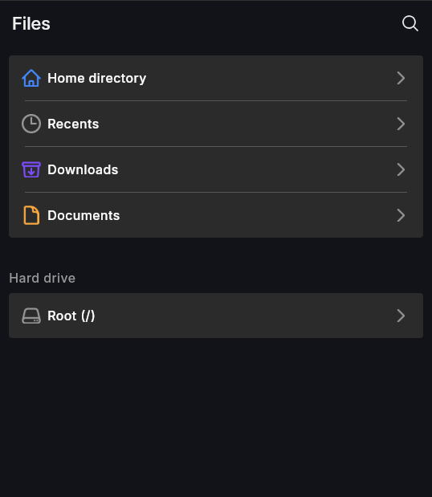
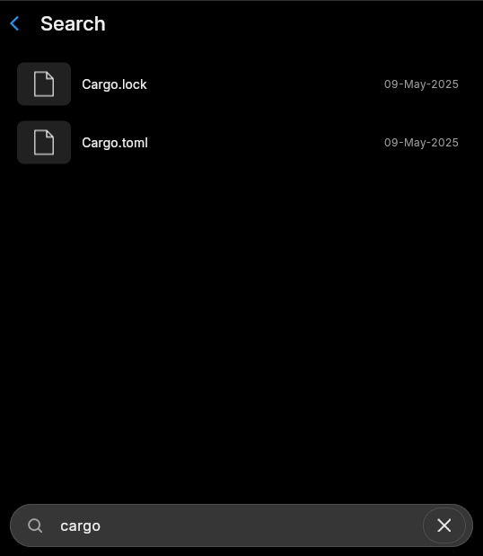
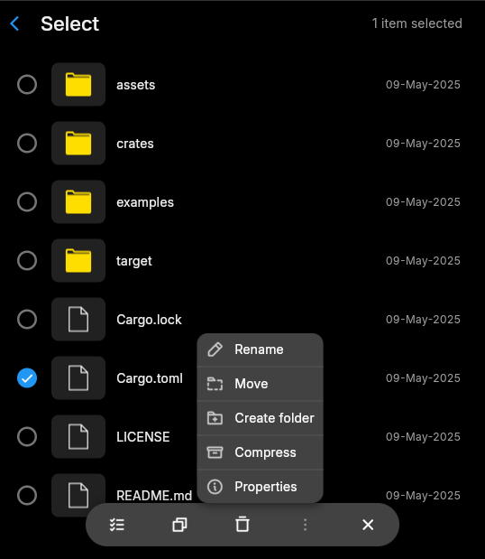
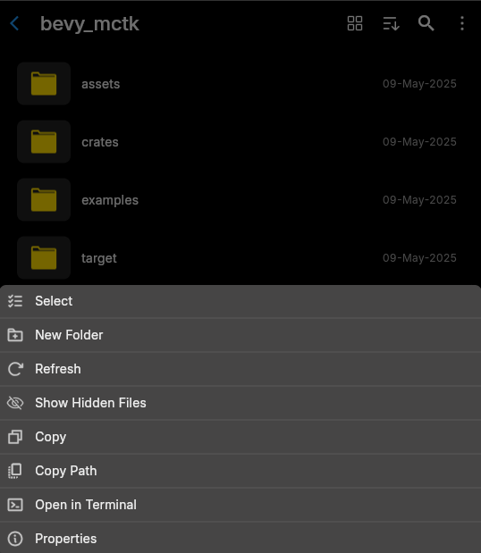

# 📁 Mechanix Files

Files App lets you organize and manage your files and folders in your Mecha Comet, made in Flutter. It allows to browse, search, sort, manage documents with user friendly interface. 

## 📦 Install Guide

### 📝 Pre-requisites:
- To install flutter, follow this : [https://docs.flutter.dev/install](https://docs.flutter.dev/install)
- To install flutter-elinux, follow this : [https://github.com/sony/flutter-elinux](https://github.com/sony/flutter-elinux)

### 🚀 Steps to run Files App:
1. Clone the repository :
    ```
    $ git clone https://github.com/mecha-org/mechanix-gui.git
    $ cd apps/files
    ```
2. Install Flutter dependencies:

    For flutter-elinux:
    ```
    $ flutter-elinux pub get
    ```

    For flutter: 
      ```
    $ flutter pub get
    ```
3. Build and Run:

    For flutter-elinux:
    ```
    $ flutter-elinux build
    $ flutter-elinux run
    ```

    For flutter: 
    ```
    $ flutter build
    $ flutter run
    ```

## 🔑 Key Features

- **File Browsing**: Easily browse through files and folders on your device.
- **Files Organization**: Create, rename, copy, paste and delete, sort files & folders to keep your files organized.
- **Search**: Quickly search for files by name.
- **Open Files**: Open images, videos, and other files.
- **Multiple File Selection**: Select multiple files for bulk actions like copying or deleting.
- **File/Folder Properties**: View the total storage usage on your device. 

### 🖼️ Screenshots: 

 




 

  
### To open files with specific path - with exec  `MECHANIX_FILES_OPEN_PATH=/home/mecha/meson_options.txt ./build/elinux/x64/release/bundle/mechanix_files -b .`

### On build time you can pass `--dart-define=OPEN_PATH=<MECHANIX_FILES_OPEN_PATH>`
