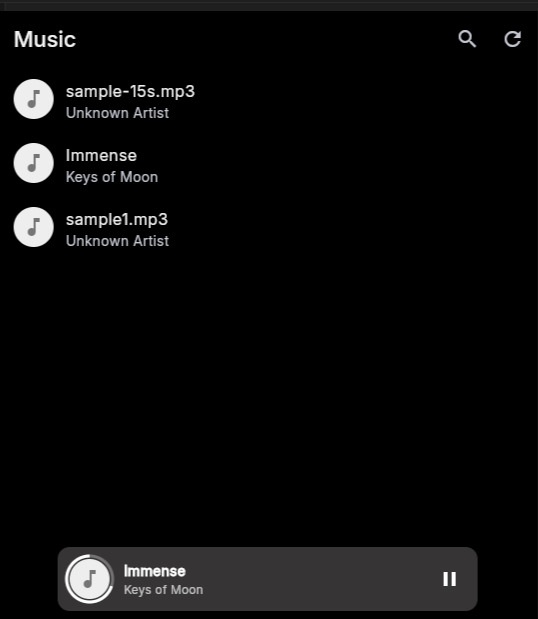
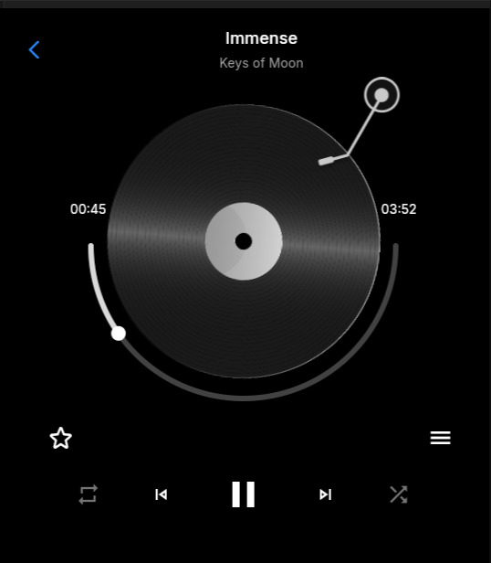

#  🎶 Music App

A lightweight and efficient music player application built with Flutter for Embedded Linux devices.

> **Your personal soundtrack for every moment!**

## Install Guide

### Pre-requisites:
- To install flutter, follow this : [https://docs.flutter.dev/install](https://docs.flutter.dev/install)
- To install flutter-elinux, follow this : [https://github.com/sony/flutter-elinux](https://github.com/sony/flutter-elinux)

### Steps to run Settings App:
1. Clone the repository :
    ```bash
    $ git clone https://github.com/mecha-org/mechanix-gui.git
    $ cd apps/music
    ```
2. Install Flutter dependencies:

    For flutter-elinux:
    ```bash
    $ flutter-elinux pub get
    ```

    For flutter:
    ```bash
    $ flutter pub get
    ```
3. Build and Run:

    For flutter-elinux:
    ```bash
    $ flutter-elinux build
    $ flutter-elinux run
    ```

    For flutter:
    ```bash
    $ flutter build
    $ flutter run
    ```

## 🚀 Features

### 🎵 Core Playback Controls
- **Play/Pause**: Start and stop your music seamlessly
- **Next Track**: Skip to the following song
- **Previous Track**: Go back to the previous song
- **Progress Bar**: Visual timeline of current track

### App Screenshots





