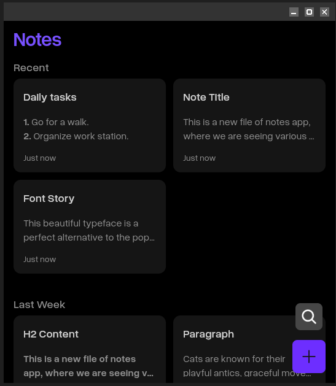
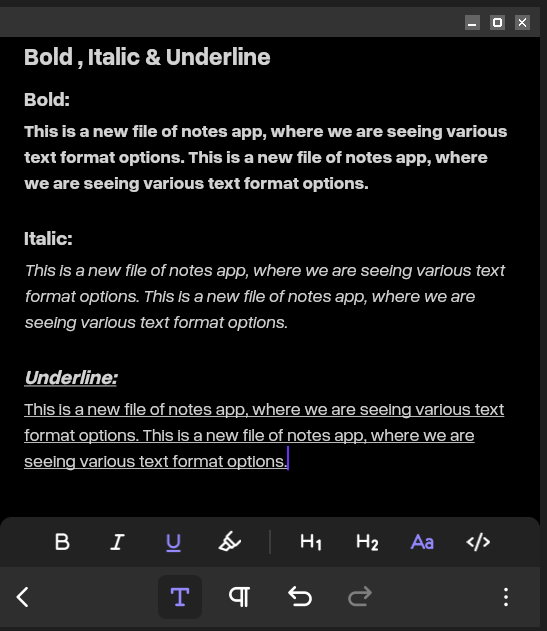
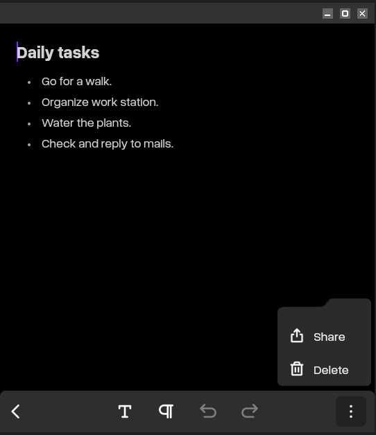

# 📝 Notes App

A powerful and intuitive notes application built with Flutter for Embedded Linux devices.

> **Never lose a brilliant idea again!**

## 📦 Install Guide

### Pre-requisites

- Install Flutter:  
  https://docs.flutter.dev/install
- Install Flutter for Embedded Linux (flutter-elinux):  
  https://github.com/sony/flutter-elinux

### Steps to Run Notes App

1. Clone the repository:

   ```bash
   $ git clone https://github.com/mecha-org/mechanix-gui.git
   $ cd apps/notes
   ```

2. Install dependencies:

   ```bash
   $ flutter-elinux pub get
   ```

3. Build and run:

   ```bash
   $ flutter-elinux build elinux --release
   $ flutter-elinux run
   ```

## 🚀 Features Overview

### ✍️ Rich Text Editing

Create well-structured and visually clear notes using a powerful rich text editor.

- Text emphasis and inline formatting
- Headings and paragraph styles
- Inline code and code blocks
- Multiple list types for better organization

---

## 🧰 Editor Toolbars

### 1. Text Emphasis Toolbar

Used for **inline text styling and headings**.

**Supported options:**

- **Bold**
- _Italic_
- <u>Underline</u>
- Highlight text
- Heading 1 (H1)
- Heading 2 (H2)
- Paragraph
- Inline code

---

### 2. List & Blocks Toolbar

Used for **structuring content and task management**.

**Supported blocks:**

- Bullet list
- Numbered list
- Checkbox list (To-Do list)
- Code block

---

## 🔄 Editor Actions

These actions are available independently of toolbars:

- **Undo**
- **Redo**
- **Share note**
- **Delete note**

---

## ⌨️ Keyboard Shortcuts

### Text Formatting Shortcuts

| Action    | Shortcut   |
| --------- | ---------- |
| Bold      | `Ctrl + B` |
| Italic    | `Ctrl + I` |
| Underline | `Ctrl + U` |

---

## 🧠 Markdown Shortcuts

The editor supports **two types of markdown shortcuts** for faster writing.

---

### 1. Space-Based Markdown Shortcuts

(Triggered when typing at the start of a new line and pressing space)

| Pattern | Result                |
| ------- | --------------------- |
| `- `    | Bullet list           |
| `* `    | Bullet list           |
| `1. `   | Numbered list         |
| `[] `   | Checkbox (To-Do) list |
| `# `    | Heading 1             |
| `## `   | Heading 2             |
| `### `  | Heading 3             |
| ` ``` ` | Code block            |

---

### 2. Character-Based Markdown Shortcuts

(Triggered by wrapping text with characters)

| Pattern    | Result      |
| ---------- | ----------- |
| `text`     | Inline code |
| `*text*`   | Italic      |
| `**text**` | Bold        |
| `__text__` | Underline   |

---

## 🔍 Search Functionality

The Notes App includes an optimized and predictable search experience designed for accuracy and performance on embedded devices.

### Search Rules

- Search is triggered only when **3 or more characters** are entered
- Matches are performed using **exact character matching**

### Result Ranking Logic

Search results are ranked using a **priority-based scoring system**:

1. **Total Score (Highest Priority)**  
   Overall relevance score calculated for a note

2. **Editor Content Score**  
   Matches found within the note editor content are prioritized

3. **Descending Score Order**  
   Final results are sorted in **descending order of relevance score**

This approach ensures that the most relevant notes appear at the top while maintaining fast and deterministic search behavior.

---

## 📦 Packages Used

This application is built using carefully selected Flutter packages to ensure a rich editing experience and reliable local storage.

### flutter_quill

- Rich text editor used as the core of the Notes Editor
- Supports text formatting, lists, code blocks, and markdown-style shortcuts
- Enables advanced document structure and inline styling

🔗 https://pub.dev/packages/flutter_quill

---

### Hive

- Lightweight and fast local NoSQL database
- Used to store notes efficiently on the device
- Works seamlessly in embedded Linux environments without external dependencies

🔗 https://pub.dev/packages/hive

---

## 🖼️ App Screenshots

### 1. Home Page



### 2. Search Notes


### 3. Notes Editor Page


### 4. Text Emphasis Toolbar



### 5. List & Blocks Toolbar


### 6. Share and Delete Menu


