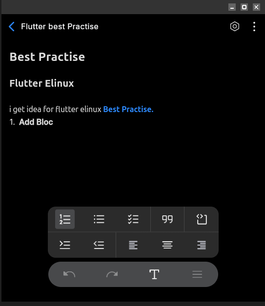
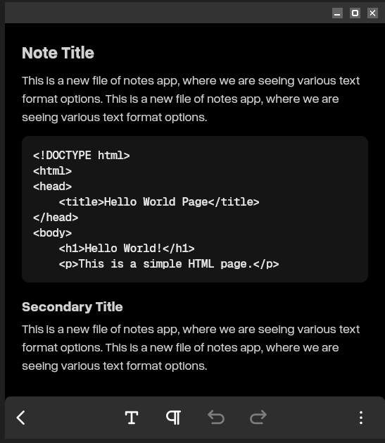
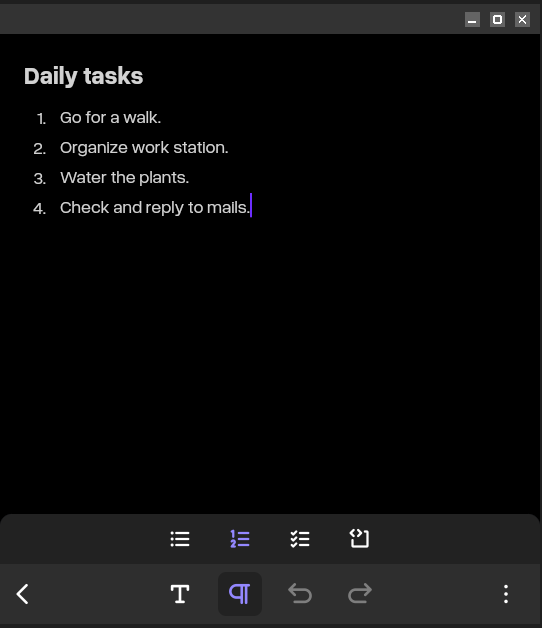

# 📝 Notes App

A powerful and intuitive notes application built with Flutter for Embedded Linux devices.

> **Never lose a brilliant idea again!**

## Install Guide

### Pre-requisites:
- To install flutter, follow this : [https://docs.flutter.dev/install](https://docs.flutter.dev/install)
- To install flutter-elinux, follow this : [https://github.com/sony/flutter-elinux](https://github.com/sony/flutter-elinux)

### Steps to run Notes App:
1. Clone the repository :
    ```bash
    $ git clone https://github.com/mecha-org/mechanix-gui.git
    $ cd apps/notes
    ```
2. Install Flutter dependencies:

    For flutter-elinux:
    ```bash
    $ flutter-elinux pub get
    ```

    For flutter:
    ```bash
    $ flutter pub get
    ```
3. Build and Run:

    For flutter-elinux:
    ```bash
    $ flutter-elinux build
    $ flutter-elinux run
    ```

    For flutter:
    ```bash
    $ flutter build
    $ flutter run
    ```

## 🚀 Features

### Rich Text Editing
- **Text Styling**: Customize your text with different styles
- **Color Options**: Add colors to make your notes visually organized  
- **Text Positioning**: Align your text left, center, or right for better structure

### Advanced List Types
- **Numbered Lists**: Create ordered lists for step-by-step instructions
- **Dotted Lists**: Make bullet points for quick notes and ideas
- **Checkbox Lists**: Track tasks and to-do items with interactive checkboxes

### Special Content Blocks
- **Quote Blocks**: Highlight important quotes and references
- **Code Blocks**: Perfect for developers to save code snippets and technical notes

### Note Limits

- **Title Length**: Maximum 25 characters

## App Screenshots







