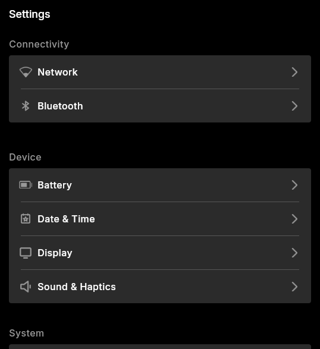
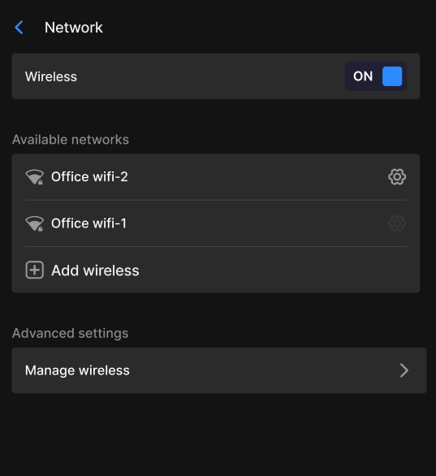

# ⚙️ Mechanix Settings

Settings App provides access you to various configuration options like Network, Bluetooth, Display, etc for your Mecha Comet, made in Flutter.

## 📦 Install Guide

### 📝 Pre-requisites:
- To install flutter, follow this : [https://docs.flutter.dev/install](https://docs.flutter.dev/install)
- To install flutter-elinux, follow this : [https://github.com/sony/flutter-elinux](https://github.com/sony/flutter-elinux) 

### 🚀 Steps to run Settings App:
1. Clone the repository :
    ```
    $ git clone https://github.com/mecha-org/mechanix-gui.git
    $ cd apps/settings-app
    ```
2. Install Flutter dependencies:

    For flutter-elinux:
    ```
    $ flutter-elinux pub get
    ```

    For flutter: 
      ```
    $ flutter pub get
    ```
3. Build and Run:

    For flutter-elinux:
    ```
    $ flutter-elinux build
    $ flutter-elinux run
    ```

    For flutter: 
    ```
    $ flutter build
    $ flutter run
    ```
4. Build for release
    ```
    $ flutter-elinux build elinux --release
    ```
## 🔑 Key Features

Centralized Control: Easy access to Network, Bluetooth, Sound, Battery, Sound, etc settings.

1. Network  
2. Bluetooth
3. Battery
4. Date and Time
5. Display
6. Sound & Haptics
7. About

### 🖼️ Screenshots: 

 

 