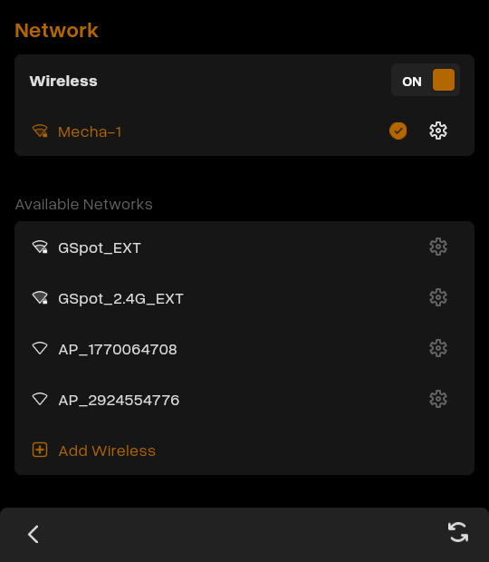
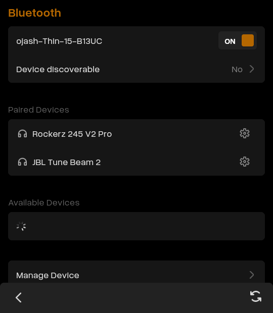
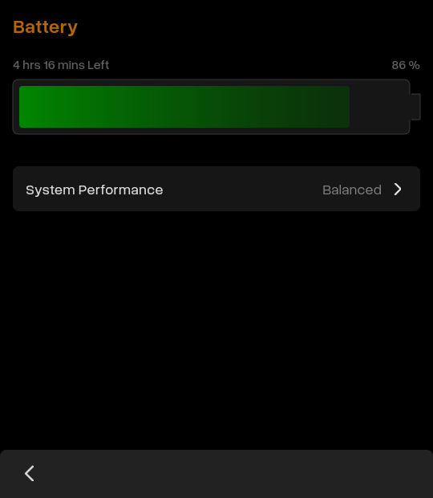
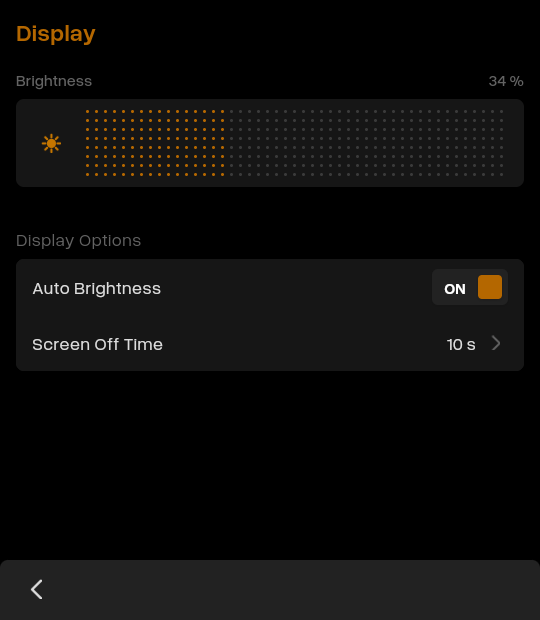
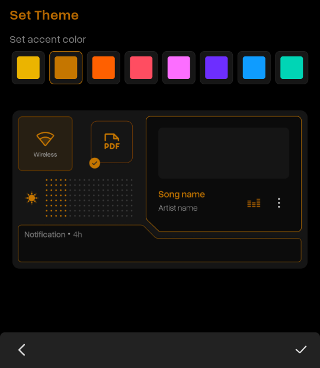
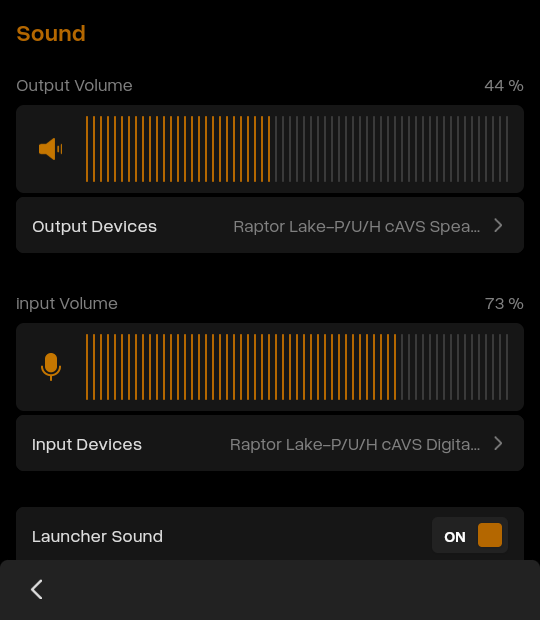
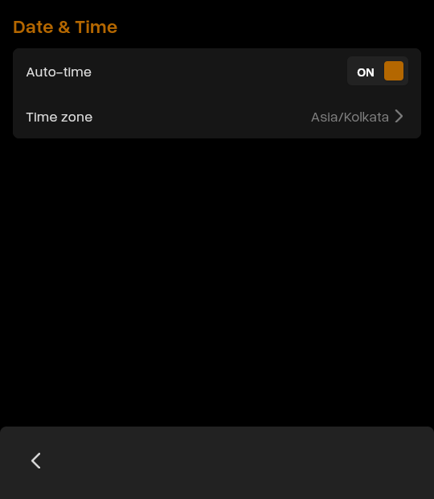

# ⚙️ Mechanix Settings

A comprehensive settings application for Mecha Comet, built with Flutter. Provides centralized access to various system configuration options including Network, Bluetooth, Display, and more.

## 📋 Table of Contents

- [Features](#-features)
- [Prerequisites](#-prerequisites)
- [Installation](#-installation)
- [Usage](#-usage)
- [Available Settings](#-available-settings)
- [Contributing](#-contributing)
- [License](#-license)

## ✨ Features

**Centralized Control Panel** - Manage all your Mecha Comet settings from one intuitive interface:

- Network Configuration
- Bluetooth Management
- Battery Monitoring
- Date & Time Settings
- Appearance Customization
- Display & Brightness
- Sound & Haptics
- System Information

## 📝 Prerequisites

Before you begin, ensure you have the following installed:

- **Flutter** - [Installation Guide](https://docs.flutter.dev/install)
- **Flutter-elinux** - [Installation Guide](https://github.com/sony/flutter-elinux)

## 📦 Installation

1. **Clone the repository:**
```bash
   git clone https://github.com/mecha-org/mechanix-gui.git
   cd apps/settings-app
```

2. **Install Flutter dependencies:**

   For flutter-elinux:
```bash
   flutter-elinux pub get
```

   For standard Flutter:
```bash
   flutter pub get
```

## 🚀 Usage

### Development Build & Run

**Using flutter-elinux:**
```bash
flutter-elinux build
flutter-elinux run
```


### Production Release Build
```bash
flutter-elinux build elinux --release
```

## 🔧 Available Settings

### 🌐 Network

Manage your internet connectivity with ease.

**Features:**
- Wi-Fi On/Off toggle
- Connect/Disconnect from networks
- Forget saved networks
- Connect to hidden networks
- Refresh available Wi-Fi networks

 

---

### 📡 Bluetooth

Connect and manage Bluetooth devices seamlessly.

**Features:**
- Bluetooth On/Off toggle
- Connect/Disconnect devices
- Forget paired devices
- Refresh available Bluetooth devices

 

---

### 🔋 Battery

Monitor and optimize your device's battery performance.

**Features:**
- View battery status and percentage
- Switch between battery modes (Power Saver, Balanced, Performance)

 

---

### 🖥️ Display & Brightness

Customize your visual experience.

**Features:**
- Adjust screen brightness

 


---

### 🎨 Appearance

Personalize your Mecha Comet's look and feel.

**Features:**
- Change wallpaper
- Switch between theme variants

 


---

### 🔊 Sound & Haptics

Control audio output and tactile feedback.

**Features:**
- Adjust volume levels
- Select output devices
- Select input devices

 


---

### 🕐 Date & Time

Keep your system clock accurate and properly configured.

**Features:**
- Change timezone
- Set date manually
- Set time manually
- Auto time synchronization options

 

---


### ℹ️ System Information

View detailed information about your Mecha Comet.

**Features:**
- Hardware specifications
- Software version
- Serial number and device ID

